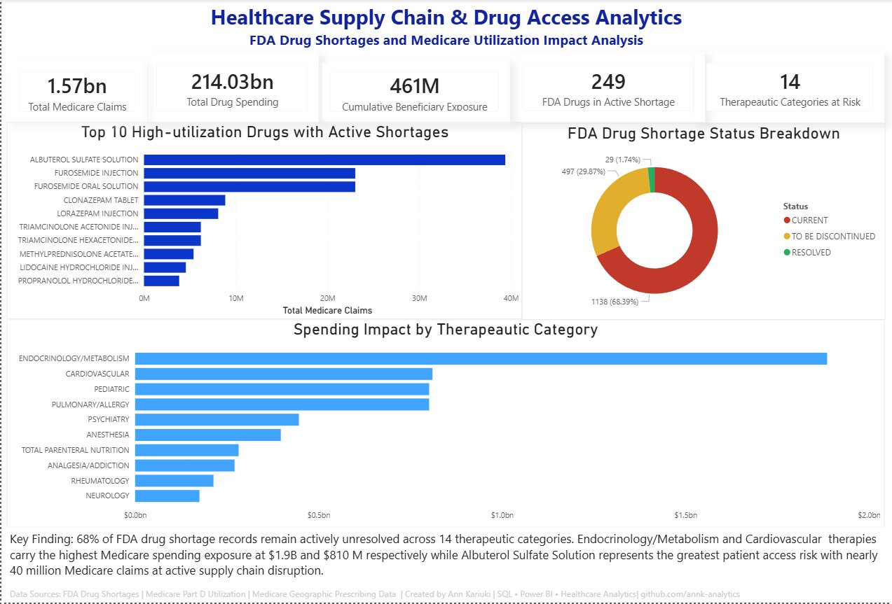
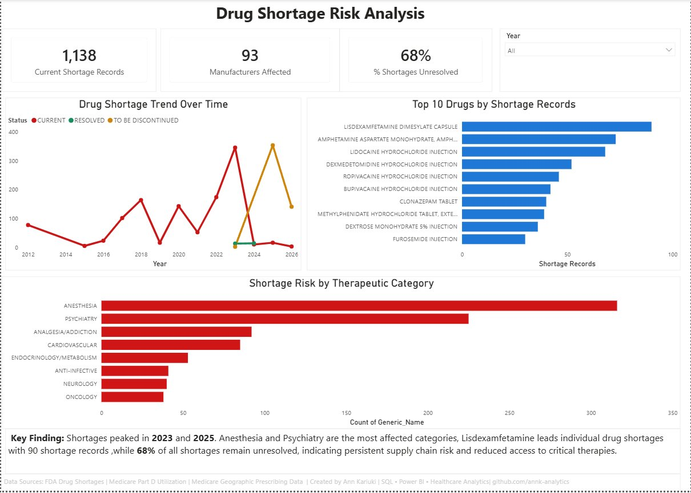
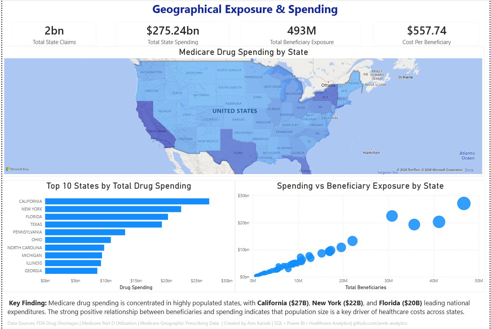

# Healthcare Supply Chain & Drug Access Analytics

FDA drug shortages and Medicare utilization analysis using SQL and Power BI.

---

## Overview

Drug shortages disrupt patient access to essential medications and negatively impact treatment continuity.In the United States,drug shortages remain a significant challenge,increasing pressure on the healthcare system. This project combines FDA shortage data with Medicare Part D utilization to identify high-demand drugs facing supply risk,measure spending exposure,and analyze geographical impacts across the United States.

---

## Business Questions

- Which therapeutic categories face the most drug shortages?
- Which high-demand drugs are currenly in active shortage?
- How much Medicare spending is exposed to shortage risk?
- Where is drug spending concentrated geographically?

---

## Data Sources

| Dataset | Source | Records |
|---------|--------|---------|
| FDA Drug Shortages | fda.gov | ~1,600 |
| Medicare Part D (CMS) | data.cms.gov | ~116,000 |

---

## Tools

SQL Server (SSMS) · Power BI · GitHub

---

## Skills Demonstrated

Data cleaning · Data quality fixes · Exploratory analysis · Cross-Dataset joins · SQL views · Dashboard design · Healthcare Analytics · Insight Generation

---

## Approach

| Step | Script | What it does |
|------|--------|--------------|
| 1. Data Cleaning | `01_data_cleaning.sql` | Stage, standardize, deduplicate, validate data |
| 2. Data Quality | `02_data_quality_fixes.sql` | Reduce 50+ messy categories to 23 clean ones for easy reporting |
| 3. Exploratory Analysis | `03_exploratory_analysis.sql` | Explore shortages, utilization, and spending patterns|
| 4. Integrated Joins | `04_integrated_joins.sql` | Link FDA shortages to Medicare utilization and spending |
| 5. Views | `05_views.sql` | Reusable views for Power BI dashboards |

The FDA and Medicare datasets use defferent naming conventions for medication, so the records were linked by matching on the first word of the drug name.

---

## Dashboards

### 1. Executive Summary

### 2. Drug Shortage Risk Analysis

### 3. Geographical Exposure & Spending

Full PDF in the [`dashboards/`](dashboards/) folder.

---

## Key Findings

- **68% of FDA drug shortages remain unresolved** across 14 therapeutic categories — disruptions persist rather than recover.
- **Anesthesia and Psychiatry carry the highest shortage burden**, exposing critical and mental health care.
- **Endocrinology/Metabolism and Cardiovascular lead spending exposure** at **$1.9B** and **$810M**.
- **Albuterol Sulfate Solution is the top access risk** — nearly **40M Medicare claims** tied to an active shortage.
- **Drug Spending closely tracks population**: California ($27B), New York ($22B), and Florida ($20B) lead, rising in step with beneficiaries.

---

## Author

**Ann Kariuki** 
MBA in Business Analytics | Data & Healthcare Analytics 
-GitHub: [github.com/annk-analytics](https://github.com/annk-analytics)
-LinkedIn: [linkedin.com/in/ann-kariuki-304b3b124](https://www.linkedin.com/in/ann-kariuki-304b3b124)

---

## License

MIT License
